# LTI - Applicant Tracking System

## 1. Visión General del Producto

### 1.1 Descripción
LTI es un ATS moderno diseñado para reducir el trabajo manual de los equipos de RRHH, acelerar la toma de decisiones y mejorar la colaboración entre reclutadores y hiring managers mediante automatizaciones inteligentes y apoyo de IA. Su propuesta de valor única (PVU) es combinar un flujo colaborativo en tiempo real con motores de IA que priorizan candidatos según criterios dinámicos de ajuste cultural y técnico, y plantillas de comunicación que autopersonalizan mensajes.

Ventajas competitivas frente a Workday/Lever/Greenhouse:
- IA contextualizada que prioriza candidatos por probabilidad de éxito en el rol y encaje cultural, no solo por coincidencia de keywords.
- Panel colaborativo en tiempo real con comentarios estructurados y tareas asignables (reduce reuniones y emails).
- Automatizaciones end‑to‑end (sourcing → screening → scheduling → oferta) con trazabilidad y auditoría.

### 1.2 Pilares Estratégicos
1. **Eficiencia para HR:** Reducir drásticamente el trabajo manual
2. **Colaboración en tiempo real:** Mejorar la comunicación entre reclutadores y managers
3. **Automatización Inteligente:** Usar IA/ML para filtrar y sugerir mejor

### 1.3 Funciones Principales
1. Dashboard colaborativo de contratación: Vista central con candidatos, estado del proceso y comentarios en tiempo real. (Pilares: colaboración, eficiencia)
2. Screening asistido por IA: Scoring que combina CV, entrevista y datos históricos para ordenar shortlists. (Pilares: automatización, eficiencia)
3. Workflows y automatizaciones: Plantillas y pipelines configurables que ejecutan acciones (emails, entrevistas, tareas). (Pilares: automatización)
4. Panel de feedback estructurado: Formularios rápidos para hiring managers con scoring y etiquetas reutilizables. (Pilares: colaboración)
5. Integración de calendario y entrevistas automatizadas: Sincronización y confirmaciones automáticas. (Pilares: eficiencia)
6. Auditoría y cumplimiento: Registro inmutable de decisiones y comunicación para cumplimiento legal. (Pilares: eficiencia)
7. Biblioteca de templates y playbooks de sourcing: Mejores prácticas reutilizables y A/B testing de mensajes. (Pilares: automatización)

## 2. Modelo de Negocio

### 2.1 Lean Canvas
Problema:
- Procesos manuales, baja colaboración y sesgo en screening.

Solución:
- IA para priorización, panel colaborativo y workflows automáticos.

Métricas Clave:
- Time-to-hire, tasa de aceptación de ofertas, % decisiones en panel sin reunión.

PVU:
- ATS colaborativo con IA contextual que reduce time-to-hire y mejora calidad del hire.

Ventaja injusta:
- Modelos entrenados con señales de éxito de empresas cliente + playbooks validados.

Canales:
- Ventas directas, partnerships con consultoras de RRHH, marketplace de integraciones.

Segmentos de clientes:
- Tech startups y scaleups, equipos de contratación distribuidos, agencias de recruiting.

Estructura de costes:
- Desarrollo IA, hosting, compliance, ventas.

Flujos de ingresos:
- Suscripción SaaS (por seat+por pipeline), módulos premium IA.

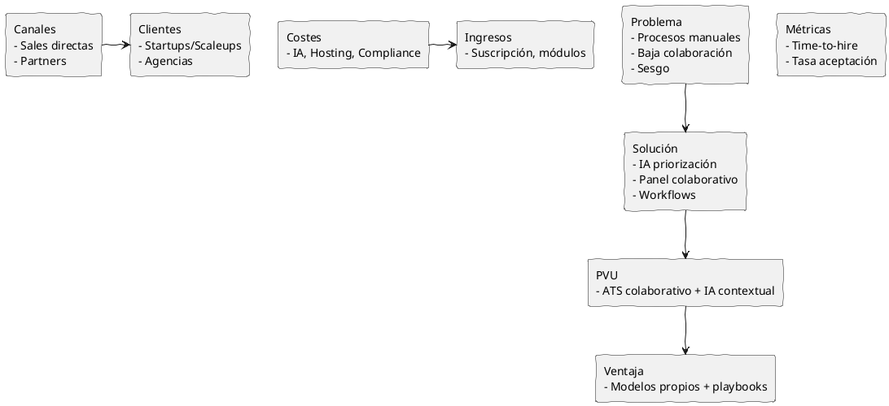

## 3. Análisis Funcional

### 3.1 Casos de Uso

### Caso de Uso 1: Screening asistido por IA
Actores: Reclutador, Sistema LTI (IA)  
Objetivo: Priorizar y presentar una short‑list de candidatos para revisión rápida.  
Flujo principal:
1. Reclutador sube/etiqueta candidatos o conecta feed de sourcing.  
2. Sistema analiza CV, historial y parámetros del rol.  
3. IA asigna score y tags (técnico, cultural, riesgo).  
4. Reclutador revisa short‑list ordenada y marca favoritos.  
5. Se generan tareas para entrevistas con hiring managers.

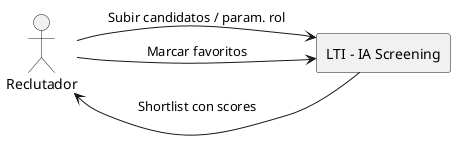

### Caso de Uso 2: Panel colaborativo de evaluación

Actores: Reclutador, Hiring Manager, Entrevistador  
Objetivo: Capturar feedback estructurado y decidir sin reuniones largas.  
Flujo principal:
1. Reclutador comparte tarjeta del candidato con panel.  
2. Managers reciben notificación y rellenan formulario short‑feedback.  
3. Sistema consolida scores, detecta discrepancias y sugiere reunión si necesario.  
4. Decision: avanzar, descartar o pedir entrevista adicional.

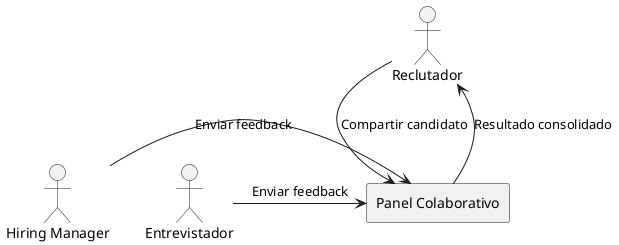

### Caso de Uso 3: Automatización de oferta y cierre
Actores: Reclutador, Candidato, Sistema LTI  
Objetivo: Automatizar envío de oferta y seguimiento para mejorar tasa de aceptación.  
Flujo principal:
1. Reclutador genera oferta usando plantilla y reglas (salary bands).  
2. Sistema envía oferta al candidato y agenda follow‑ups automáticos.  
3. Candidato responde; si acepta, el sistema crea la entrada para onboarding y notifica RRHH.  
4. Si hay contraoferta, se registra el flujo y se sugiere next steps.

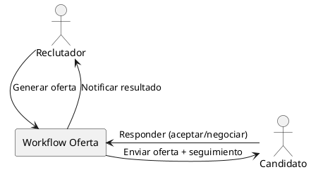
## 4. Arquitectura Técnica

### 4.1 Decisiones de Arquitectura

La arquitectura de LTI se ha diseñado siguiendo estos principios clave:

1. **Arquitectura de Microservicios**
   - Permite escalabilidad independiente de componentes
   - Facilita la evolución tecnológica por dominio
   - Mejora la resiliencia del sistema
   - Habilita el desarrollo en paralelo por equipos

2. **Patrón Event-Driven**
   - Facilita la integración asíncrona entre servicios
   - Permite reaccionar en tiempo real a cambios
   - Mejora la escalabilidad y rendimiento

3. **Diseño Multi-tenant**
   - Aislamiento de datos por empresa
   - Configuración flexible por cliente
   - Optimización de recursos compartidos

### 4.2 Modelo de Datos

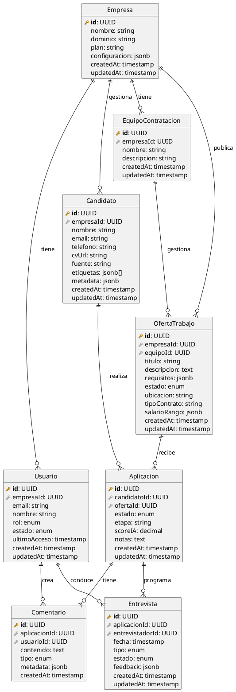

### 4.3 Diseño del Sistema

El sistema LTI está diseñado siguiendo una **arquitectura de microservicios** con un enfoque event-driven. Esta elección se justifica por:

1. **Escalabilidad independiente**: Cada servicio puede escalar según sus necesidades específicas (ej: el servicio de IA puede requerir más recursos durante picos de análisis).
2. **Flexibilidad tecnológica**: Permite usar diferentes tecnologías por servicio (ej: Node.js para tiempo real, Python para ML).
3. **Resiliencia**: Los servicios pueden fallar de manera aislada sin afectar todo el sistema.
4. **Desarrollo ágil**: Equipos diferentes pueden trabajar en servicios distintos sin interferencias.

```plantuml
@startuml C4_Container
!include https://raw.githubusercontent.com/plantuml-stdlib/C4-PlantUML/master/C4_Container.puml

Person(client, "Cliente Web", "Navegador web (SPA)")
Person(mobile, "Cliente Móvil", "App móvil")

System_Boundary(c1, "LTI Platform") {
    Container(api_gateway, "API Gateway", "Kong/Traefik", "Enrutamiento, autenticación, rate limiting")
    
    Container(auth_service, "Servicio de Autenticación", "Node.js/Express", "Gestión de identidad y acceso")
    ContainerDb(auth_db, "Auth Database", "PostgreSQL", "Usuarios, roles, permisos")
    
    Container(job_service, "Servicio de Ofertas", "Node.js/Express", "Gestión de ofertas y equipos")
    ContainerDb(job_db, "Jobs Database", "PostgreSQL", "Ofertas, equipos, workflows")
    
    Container(candidate_service, "Servicio de Candidatos", "Node.js/Express", "Gestión de candidatos y aplicaciones")
    ContainerDb(candidate_db, "Candidates Database", "PostgreSQL", "Candidatos, aplicaciones, entrevistas")
    
    Container(collab_service, "Servicio de Colaboración", "Node.js/Socket.io", "Tiempo real y notificaciones")
    ContainerDb(collab_db, "Collab Database", "MongoDB", "Comentarios, actividad, notificaciones")
    
    Container(ai_service, "Servicio de IA", "Python/FastAPI", "Scoring y análisis")
    ContainerDb(ai_db, "AI Database", "PostgreSQL", "Modelos, métricas, histórico")
    
    Container(notification_service, "Servicio de Notificaciones", "Node.js/Express", "Emails, push, in-app")
    
    Container(event_bus, "Event Bus", "Apache Kafka", "Comunicación asíncrona entre servicios")
    
    Container(file_service, "Servicio de Archivos", "Node.js/Express", "Gestión de CVs y documentos")
    ContainerDb(file_storage, "Object Storage", "S3", "Almacenamiento de archivos")
}

Rel(client, api_gateway, "Usa", "HTTPS/WSS")
Rel(mobile, api_gateway, "Usa", "HTTPS/WSS")

Rel(api_gateway, auth_service, "Autentica", "HTTPS")
Rel(api_gateway, job_service, "Enruta", "HTTPS")
Rel(api_gateway, candidate_service, "Enruta", "HTTPS")
Rel(api_gateway, collab_service, "Enruta", "HTTPS/WSS")

Rel(auth_service, auth_db, "Lee/Escribe", "SQL")
Rel(job_service, job_db, "Lee/Escribe", "SQL")
Rel(candidate_service, candidate_db, "Lee/Escribe", "SQL")
Rel(collab_service, collab_db, "Lee/Escribe", "MongoDB")
Rel(ai_service, ai_db, "Lee/Escribe", "SQL")
Rel(file_service, file_storage, "Lee/Escribe", "S3 API")

Rel(job_service, event_bus, "Publica/Suscribe", "Kafka")
Rel(candidate_service, event_bus, "Publica/Suscribe", "Kafka")
Rel(collab_service, event_bus, "Publica/Suscribe", "Kafka")
Rel(ai_service, event_bus, "Publica/Suscribe", "Kafka")
Rel(notification_service, event_bus, "Suscribe", "Kafka")

@enduml
```

### 4.4 Componentes Principales

#### 4.4.1 Servicio de Colaboración en Tiempo Real

El Servicio de Colaboración es crítico para cumplir con el requisito de colaboración en tiempo real. A continuación se detalla su arquitectura interna:

```plantuml
@startuml C4_Component
!include https://raw.githubusercontent.com/plantuml-stdlib/C4-PlantUML/master/C4_Component.puml

Container_Boundary(collab_service, "Servicio de Colaboración") {
    Component(api_controller, "API Controller", "Express.js", "REST endpoints para operaciones síncronas")
    Component(websocket_manager, "WebSocket Manager", "Socket.io", "Gestión de conexiones y eventos en tiempo real")
    Component(session_manager, "Session Manager", "Redis", "Gestión de sesiones y presencia")
    
    Component(comment_service, "Servicio de Comentarios", "TypeScript", "Lógica de negocio para comentarios")
    Component(notification_service, "Servicio de Notificaciones", "TypeScript", "Lógica de notificaciones en tiempo real")
    Component(activity_service, "Servicio de Actividad", "TypeScript", "Tracking de actividad y analytics")
    
    Component(event_handler, "Event Handler", "TypeScript", "Procesamiento de eventos del sistema")
    Component(db_connector, "DB Connector", "Mongoose", "Acceso a datos MongoDB")
    Component(kafka_client, "Kafka Client", "KafkaJS", "Integración con Event Bus")
    
    Component(cache_manager, "Cache Manager", "Redis", "Caché de datos frecuentes")
}

Rel(api_controller, comment_service, "Usa")
Rel(api_controller, notification_service, "Usa")
Rel(api_controller, activity_service, "Usa")

Rel(websocket_manager, session_manager, "Gestiona")
Rel(websocket_manager, notification_service, "Emite")
Rel(websocket_manager, comment_service, "Procesa")

Rel(comment_service, db_connector, "Persiste")
Rel(notification_service, db_connector, "Persiste")
Rel(activity_service, db_connector, "Persiste")

Rel(event_handler, kafka_client, "Consume/Produce")
Rel(event_handler, notification_service, "Dispara")
Rel(event_handler, activity_service, "Registra")

Rel(comment_service, cache_manager, "Lee/Escribe")
Rel(notification_service, cache_manager, "Lee/Escribe")

@enduml
```
## 5. Diagramas de Secuencia

A continuación se incluyen diagramas de secuencia que ilustran flujos críticos del sistema.

### 5.1 Screening asistido por IA
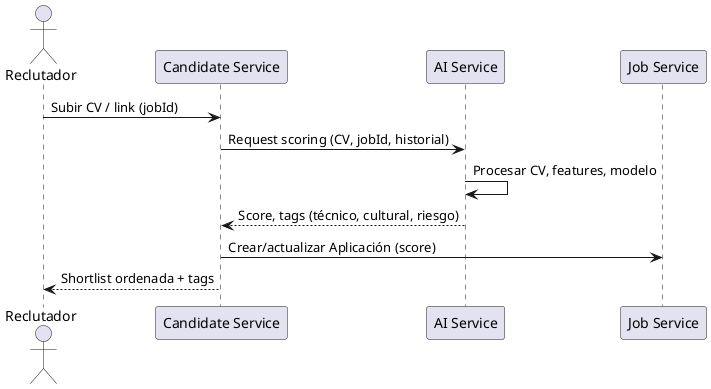

### 5.2 Panel colaborativo de evaluación
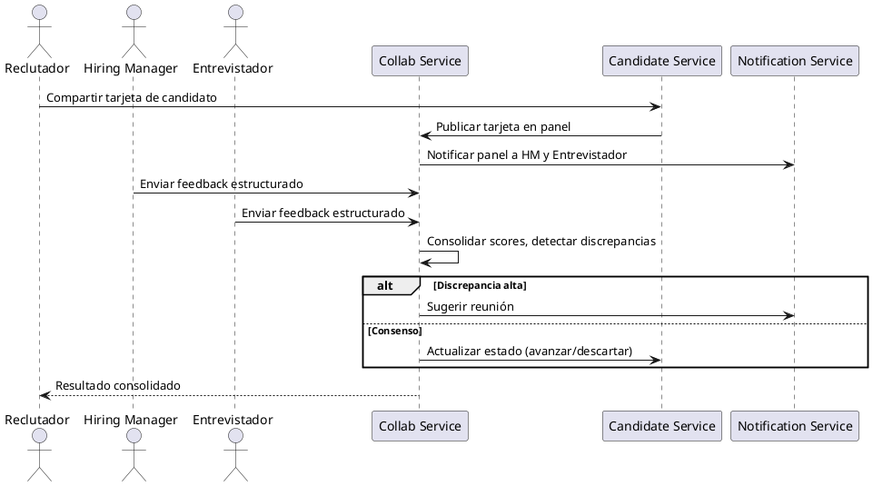

### 5.2.1 Panel colaborativo de evaluación (DETALLADO)

Objetivo: Capturar feedback estructurado, consolidar evidencia y acelerar decisiones con trazabilidad y mínima fricción.

Resumen del flujo:
- Reclutador comparte la tarjeta del candidato → panel colabora en línea.
- Miembros del panel rellenan un formulario estructurado (scores + etiquetas + comentario breve).
- Servicio de Colaboración valida, persiste y emite notificaciones.
- Motor de consolidación agrega scores (algoritmo robusto), detecta discrepancias y decide si escalar a reunión o aplicar regla automática.
- Todas las acciones generan eventos y registro de auditoría.

Campos del formulario de feedback (recomendado):
- Score técnico (0-10)
- Score cultural/encaje (0-10)
- Score potencial/crecimiento (0-10)
- Recomendación (Avanzar / Entrevista / Rechazar)
- Tags rápidas (p. ej. Seniority, Stack, Riesgo)
- Comentario libre (máx 500 chars)
- Confidencialidad / visibilidad

Reglas de agregación (sugerencia):
- Usar mediana para cada dimensión + conteo de evaluadores.
- Detectar outliers (desviación > 1.5 IQR) y marcar para revisión.
- Si desviación estándar entre evaluadores > 2 puntos en any dimension → "Discrepancia alta".
- Si >=75% de evaluadores recomiendan "Avanzar" → decisión automática "Avanzar".
- Registrar siempre la decisión automática / manual en el audit log con versionado.

Notificaciones y permisos:
- Notificar hiring manager(s) y entrevistadores asignados al publicar.
- Permisos por rol: solo reclutadores y managers pueden forzar decisión final; entrevistadores pueden proponer.
- Historial visible en la tarjeta del candidato con timestamp y usuario.

### 5.2.1.1 Diagrama: publicación, recolección y consolidación
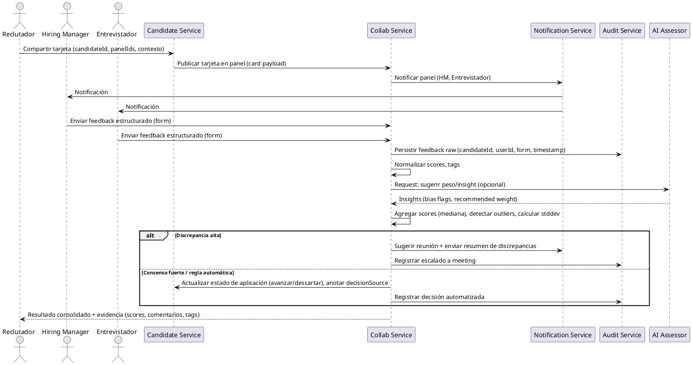
### 5.2.1.2 Diagrama: resolución de discrepancias (reunión y decisión)
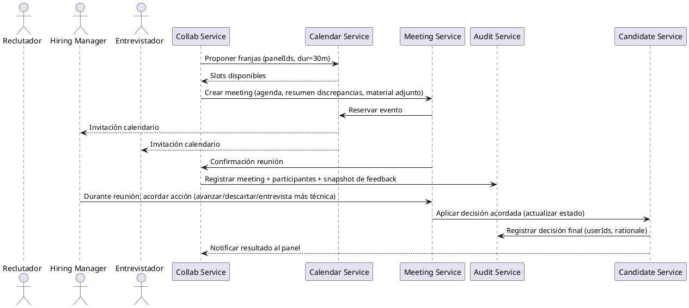
Notas operativas:

- Mantener snapshot inmutable de feedback antes de consolidación para auditoría.
- Exponer endpoint para exportar evidence pack (scores, comentarios, timeline) para compliance o HR reviews.
- Considerar UI: highlights visuales para discrepancias, filtro por tags y timeline inline.
### 5.3 Automatización de oferta y cierre
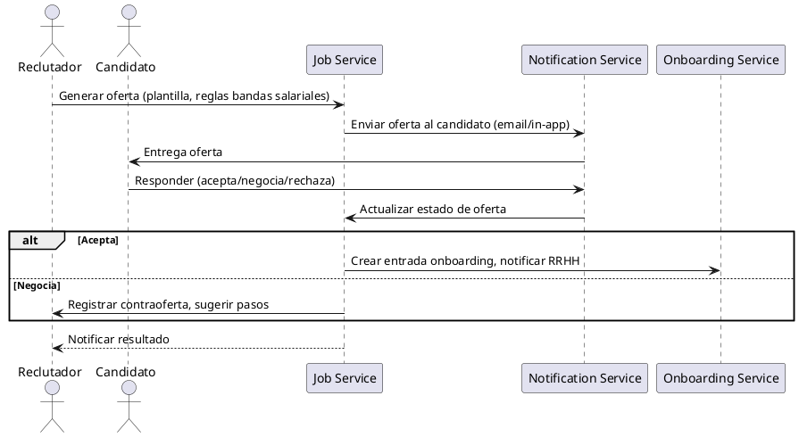

### 5.4 Programación automática de entrevistas
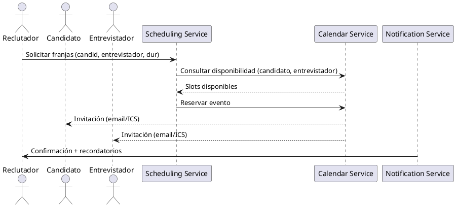

### 5.5 Pipeline IA: entrenamiento y predicción (simplificado)
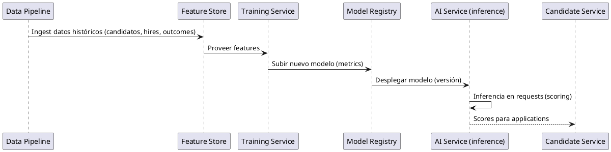
## 6. Anexos

### 6.1 Prompts de Diseño
1. **Product Manager Senior**: Definición inicial del producto, funcionalidades y casos de uso.
2. **Arquitecto de Software Senior**: Diseño de la arquitectura técnica, incluyendo modelo de datos (ER), arquitectura de microservicios y componentes detallados del sistema. Ver detalles en `prompts.md`.